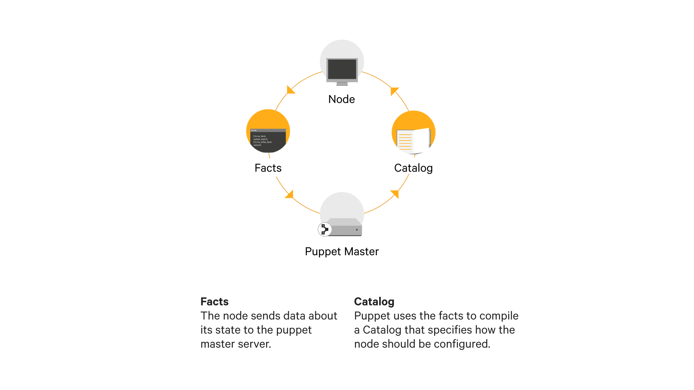



# Agentの実行

## クエストの目的

- Puppet agent実行のプロセスを理解する。
- agent証明書のリスト化と署名の方法を学ぶ。
- *site.pp*マニフェストを使ってノードを分類する。 

## はじめに

> いいかい、ここでは、めいっぱい走っていなくてはいけない、同じ場所にい続けるためにね。

> - ルイス・キャロル

前回のクエストで学んだ`puppet resource`コマンドを使うと、リソース抽象化レイヤーによってPuppet稼働時のシステムの動作を確認することができます。Puppetのコマンドラインツールを使ったリソースの探索や操作は確かに便利ですが、リソース抽象化レイヤーの真価は、Puppet masterでインフラストラクチャ内のすべてのシステムを管理するための単一の共通言語を提供することにあります。

このクエストではPuppet agentを実行し、Puppet agentがどのようにPuppet masterサーバと通信するか見ていきます。その後、Puppet master上のマニフェストのPuppetコードをいくつか記述し、agentシステムのあるべき状態を定義していきます。

準備はできましたか？　Learning VMで以下のコマンドを実行してください。

    quest begin agent_run

## agent/masterのアーキテクチャ

前回のクエストでも説明したように、Puppetは通常、agent/master(クライアント/サーバ)と呼ばれるアーキテクチャで使用されます。

このアーキテクチャでは、インフラストラクチャ内で管理される各ノードが*Puppet agent*サービスを実行します。1つまたは複数のサーバ(インフラストラクチャのサイズと複雑さによって異なります)が*Puppet master*として機能し、Puppetサーバサービスを実行してagentとの通信を処理します。デフォルトの*モノリシック*masterインストールでは、Puppet masterサーバは、PEコンソールサービスやPuppetDBといった複数のサービスをホストします。より大規模なデプロイでは、これらのサービスを他のサーバに分散させ、パフォーマンスを向上させて冗長性を得ることができます。

デフォルトでは、Puppet agentサービスは30分ごとにPuppet実行を開始します。この定期的な実行により、Puppetコードに記述したあるべき状態にシステムを維持することができます。実行と実行の間に生じた設定のずれは、次回のagent実行時に修正されます。

Learning VMのagentシステムでは、この自動実行は無効になっています。自動実行の代わりに手動で実行を開始すると、Puppetの仕組みを学ぶ際のコントロールと可視性が高まります。



Puppet agentは、Puppet実行を開始する際にPuppet masterに*カタログリクエスト*を送信します。このリクエストには、*Facter*と呼ばれるツールによって提供されるagentシステムの情報が含まれています。

Puppet masterは、Facterの提供するこの情報をPuppetコードとともに使用し、システム上のリソースをどう設定すべきかをagentに正確に伝えるためのカタログをコンパイルします。

Puppet masterは、インフラストラクチャ内のシステムのあるべき状態を定義するために作成されたPuppetコードベースのコピーを保持します。このPuppetコードは主に、前回のクエストで見たようなリソース宣言で構成されます。Puppetコードの最終目的はリソースを定義することですが、変数、クラス、条件といった言語要素も含まれ、これにより、システム上に置きたいリソースやそのパラメータ設定をコントロールすることができます。masterはこのコードを構文解析し、 *カタログ*を作成します。このカタログは、agentノードのあるべき状態を定義するシステムリソースの最終リストにあたります。

Puppet masterがこのカタログをPuppet agentに送り返すと、Puppet agentは *プロバイダ*を使って、カタログで定義された各リソースのあるべき状態が、システム上のリソースの実際の状態と一致しているかどうかをチェックします。相違がある場合、カタログで定義された状態とシステムの実際の状態を一致させるため、プロバイダによって変更が施されます。

最後に、Puppet agentがレポートを作成します。これには、変更されていないリソース、成功した変更、実行時にエラーが生じた場合はエラーに関する情報が含まれています。Puppet agentがこのレポートをPuppet masterに送信すると、Puppet masterはレポートをPuppetDBに保存し、PEコンソールのウェブGUIから利用できるようにします。

## 証明書

Puppet agent実行のデモンストレーションに進む前に、もう1つ注意しておくことがあります。

agentとmasterの間のすべての通信は、SSLで行われます。masterがagentと通信する前に、agentノードの信頼性を検証する方法が必要です。これにより、agentノードになりすましてカタログ内の秘密データにアクセスする不正な接続を防止できます。Puppetはカタログ内で[データ暗号化オプション](https://puppet.com/blog/encrypt-your-data-using-hiera-eyaml)を提供していますが、カタログリクエストを出せるシステムを予めコントロールしておくことが最善策です。

Puppetは Puppet masterと通信するすべてのシステムに対し、署名付き証明書による認証を求めています。 Puppet agentは、最初にPuppet masterと通信する際に、*証明書署名リクエスト(CSR)*を提出します。Puppet管理者はその後、CSRを提出したシステムについて、masterに対するカタログリクエストを許可すべきか否かを確認したのち、証明書に署名するかどうかを判断します(Puppetの暗号セキュリティと証明書システムの詳細については、[ドキュメントページ](https://docs.puppet.com/background/ssl/index.html)を参照してください)。

<div class = "lvm-task-number"><p>タスク1:</p></div>

最初に、agentシステムに接続します。このクエストの開始時に、前回のクエストで使用したシステムが破棄され、新しいシステムが作成されています。この新しいシステムには、Puppet agentがあらかじめインストールされているため、インストールプロセスをやり直す必要はありません。前回のクエストで使用した認証情報を使って新しいagentシステムに接続してください。

**ユーザ名: learning**  
**パスワード: puppet**

    ssh learning@agent.puppet.vm

まず、agentシステムの証明書に署名せずに、Puppet agentを実行してみましょう。agentはPuppet masterとの通信を試みますが、そのリクエストは拒否されるはずです。

    sudo puppet agent -t

以下のような通知が表示されます。

    Exiting; no certificate found and waitforcert is disabled

問題ありません。証明書に署名すればいいだけです。ここでは、コマンドラインから署名する方法を説明します。GUIから署名する場合は、コンソールに含まれている[証明書管理ツール](https://docs.puppet.com/pe/latest/console_cert_mgmt.html)を使用します。

<div class = "lvm-task-number"><p>タスク2:</p></div>

まず、SSHセッションを終了し、Puppet masterに戻ります。

    exit

`puppet cert`ツールを用いて、署名されていない証明書をリスト化します。

    puppet cert list

`agent.puppet.vm`の証明書に署名します。

    puppet cert sign agent.puppet.vm

<div class = "lvm-task-number"><p>タスク3:</p></div>

ここまでの手順で、カタログリクエストを出す権限がPuppet agentに与えられました。

## Puppet実行の開始

すでに述べたように、Puppet agentサービスでは、デフォルトで30分ごとにPuppet実行を開始するように設定されています。バックグラウンドでこの定期的な実行が行われているとPuppetのデモがわかりにくくなるため、ここではagentシステムのPuppet agentサービスを無効にしています。代わりに`puppet agent -t`コマンドを用いて、手動で実行を開始することができます。

先へ進み、agentノードに接続します。

    ssh learning@agent.puppet.vm

agent実行を開始します。すでにagentの証明書に署名済みなので、Puppet masterからカタログが送られてくるはずです。

    sudo puppet agent -t

システム上のリソースの管理については、まだ何もPuppetに指示を出していませんが、それでも、スクロールすると多くのテキストが表示されるはずです。このテキストはほとんどが、[pluginsync(プラグイン同期)](https://docs.puppet.com/puppet/latest/plugins_in_modules.html#auto-download-of-agent-side-plugins-pluginsync)と呼ばれるプロセスです。pluginsyncでは、Puppet実行を継続する前に、masterにインストールされているエクステンション(カスタムfact、リソースタイプ、プロバイダなど)がPuppet agentにコピーされます。これにより、カタログを正確に適用するために必要なすべてのツールがagentで確保されます。

このpluginsyncプロセスでは様々なものが追加されますが、ここでは 以下のような3つの行に注目します。

```
Info: Loading facts
Info: Caching catalog for agent.puppet.vm
Info: Applying configuration version '1464919481'
```

このアウトプットは、このクエストの冒頭で説明したagentとmasterの通信の片側を示しています。

Puppet agentが、実行するシステムの詳細をPuppet masterと共有するために必要なfactをロードしていることがわかります。

次に、agentがいつカタログを受信したかがわかります。これは、新規カタログのコピーをいつキャッシュしたかがわかるためです(masterに接続できない場合に、このキャッシュされたカタログをフェイルオーバーするようにPuppet agentを設定することもできます)。

最後に、Puppet agentがカタログを適用します。通常は、このステップが終わるとagentが実施したすべての変更がリスト表示されます。しかし、このケースでは、Puppet masterは、agentノードに適用するPuppetコードを検出しなかったため、(pluginsyncに関係するものを除き)この実行では変更は加えられませんでした。

## 分類

さらに興味深いことを行うには、`agent.puppet.vm`システム上の一部のリソースについて、あるべき状態を指定する必要があります。

<div class = "lvm-task-number"><p>タスク4:</p></div>

ノードの設定を記述する場合に使用するPuppetコードは、Puppet master上に保存されています。`agent.puppet.vm` agentノード上でのSSHセッションを終了し、Puppet masterに戻ります。

    exit

Puppetコードを書き始める前に、少し時間をとって、Puppet masterの観点からカタログコンパイルのプロセスを見ていきましょう。そうしておけば、コードを記述してagentに適用するとはどのようなことなのか、正確に理解できるようになります。

有効な証明書の付いたカタログリクエストを受け取ると、Puppet master上のPuppetサーバサービスが、*ノード分類*というプロセスを開始します。これは、リクエストを出したagentに関するカタログを作成するのに、どのPuppetコードをコンパイルするかを決定するプロセスです。

ノード分類には、3種類の処理方法があります。

1. `site.pp`マニフェストは、 masterの特別なファイルで、ノード定義を記述することができます。
このクエストや、以降のいくつかのクエストでは、この方法を使用します。
この方法ではノード分類の仕組みが最も直接的に
わかります。

2. PEコンソールには、GUIノード分類子が含まれています。これを使えば、
コードを直接編集せずに、ノードグループや分類を簡単に管理することができます。これは
きわめて効率的なノード分類管理方法ですが、基本となるいくつかのPuppetコンセプトに慣れてからのほうが、きちんと理解しやすいはずです。

3. 最後に、ノード分類をカスタマイズしたい場合は、
独自の[外部ノード
分類子](https://docs.puppet.com/guides/external_nodes.html)を作成することができます。
ノードの名前を引数にとり、そのノードに適用するPuppetコードが記述されたYAMLファイルを返す実行ファイルなら、
どんなものでもノード分類子になります。
これは高度なトピックスのため、このガイドでは説明しません。

## site.ppマニフェスト

Puppet agentがPuppet masterと通信すると、masterはagentのシステム名と一致する`site.pp`マニフェストのノード定義をチェックします。Puppetの世界では、「ノード」という用語は、インフラストラクチャ上のあらゆるシステムやデバイスを意味します。そのため、ノードの定義では、Puppetが対象のシステムをどのように管理すべきかを定義します。

ノード定義がどのようなものか、例を見ながら理解しましょう。`site.pp`マニフェストを開いてみてください。

    vim /etc/puppetlabs/code/environments/production/manifests/site.pp

コメントやデフォルトのノード定義をスクロールし、ファイルの一番下まで移動します(Vimでは、`G`を入力するとファイルの一番下にジャンプできます)。ここで、`agent.puppet.vm`システムの新しいノード定義を作成します。ノード定義のアウトラインは、以下のようになるはずです。

```puppet
node 'agent.puppet.vm' {

}
```

通常は、このノードブロックに1つまたは複数のクラス宣言が含まれます。クラスは関連するリソースのグループを定義し、単一のユニットとして宣言できるようにします。ノード定義でクラスを使用すると、定義がシンプルに整理されるためコードを再利用しやすくなります。クラスの詳細については、次のクエストで説明します。とりあえず先に進むため、ノード定義にリソース宣言を直接書き込みます。このケースでは、`notify`と呼ばれるリソースタイプを使用します。これは、システムに一切の変更を加えず、Puppet実行のアウトプットにメッセージを表示するものです。

以下の`notify`リソースをノード定義に追加します(コードを直接入力したほうがPuppetコードの文法を早く覚えることができますが、コンテンツをVimにペーストする場合は、`ESC`を押してコマンドモードにしてから`:set paste`と入力すると自動フォーマッティングを無効にできます。`i` を押してインサートモードに戻ってから、テキストをペーストしてください)。

```puppet
node 'agent.puppet.vm' {
  notify { 'Hello Puppet!': }
}
```

`ESC`の後、必ず`:wq`でファイルを保存してからVimを終了してください。

お気づきかもしれませんが、このリソース宣言にはパラメータが含まれていません。この`notify`リソースのうち、ここで注意が必要な要素は、表示されるメッセージのみです。`message`パラメータで明示的に設定しない場合は、このメッセージはデフォルトのリソースタイトルになります。パラメータ値のペアを省略し、タイトルを使ってリソースに表示したいメッセージを定義すれば、多少の時間の節約になります(デフォルトとしてリソースタイトルを使用するこうしたパラメータは**namevar**と呼ばれます。namevarの役割の詳細については、[Puppetドキュメント](https://docs.puppet.com/puppet/latest/lang_resources.html)を参照してください)。

ノード宣言の具体例を作成したので、今度はmasterの観点からagent実行プロセスを確認しましょう。agentがmasterと通信すると、masterは`site.pp`内で一致するノード定義を見つけ、そのノード定義に含まれるPuppetコードを使ってカタログをコンパイルします。

masterがコンパイルしたカタログをagentに送ると、agentがそのカタログを実行中のシステムに適用します。このケースでは、カタログに含まれているのは`notify`リソースだけです。したがって、agentがカタログを適用すると指定したメッセージが表示されますが、システムは変更されません。

<div class = "lvm-task-number"><p>タスク5:</p></div>

masterが構文解析するためのPuppetコードができました。ここで、agentに戻ってもう一度Puppet実行を開始しましょう。

SSH でagentノードに入ります。

    ssh learningt@agent.puppet.vm

`puppet agent`ツールを使ってPuppet実行を開始します。

    sudo puppet agent -t

アウトプットには、以下のような内容が含まれるはずです。

    Notice: Hello Puppet!
    Notice: /Stage[main]/Main/Node[agent.puppet.vm]/Notify[Hello Puppet!]/message: defined 'message' as 'Hello Puppet!'
    Notice: Applied catalog in 0.45 seconds

agentノードとの接続を切ります。

    exit

## おさらい

このクエストではまず、Puppetの*agent/masterアーキテクチャ*と、Puppet masterとagentとの通信について説明しました。agentは*カタログリクエスト*をmasterに送り、このプロセスを開始します。masterはまず、agentが有効な*証明書*を保持しているかどうかを確認します。証明書が有効な場合、masterはいくつかの*分類*手法により、カタログコンパイルのプロセスを開始します。このクエストでは、`site.pp`マニフェストの*ノード定義*を用いてノードを分類しました。その後、masterがカタログをコンパイルし、agentに送り返します。agentは、システムの現在の状態がカタログで記述されているあるべき状態と一致しているかどうかを確認し、一致させるために必要な変更を施します。このクエストでは、わかりやすくするために、システムに変更を加えずにメッセージを表示する`notify`リソースを使用しました。agentがカタログを適用すると(または、エラーが生じカタログの適用に失敗すると)、実行結果のレポートがmasterに送信され、PuppetDBに保存されます。

ここまでで、リソース抽象化レイヤー、Puppet実行に関するagent/master通信、`site.pp`マニフェストを用いた簡単な分類の例について説明しました。これで、Puppetの基礎を理解できたと思います。Puppetのその他の要素は、この基礎の上に成り立っています。
